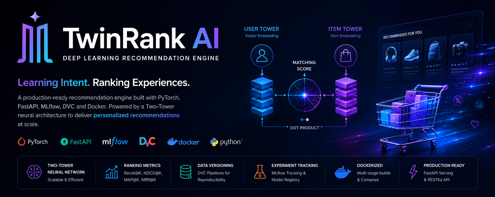
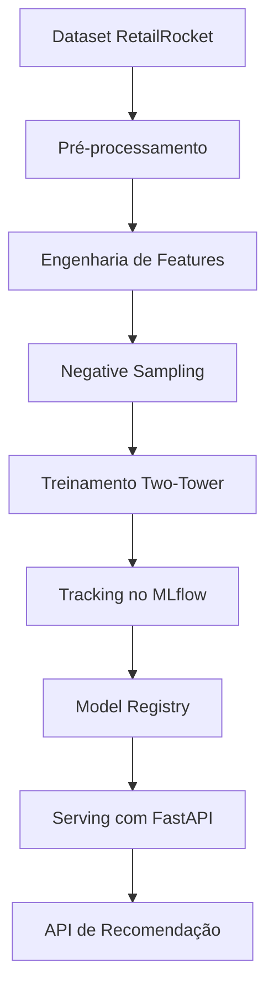
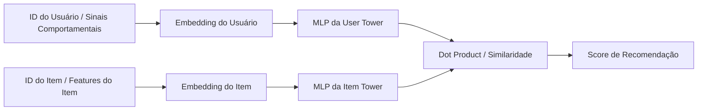

# TwinRank AI

 [🇧🇷 Português](README.md) · [🇬🇧 English](README.en.md)

 🌐 **[Acesse a Live Demo no Streamlit (SaaS)](https://twinrankai.streamlit.app/)**

 

**Motor de Recomendação com Deep Learning**

[](https://pytorch.org/)
[](https://fastapi.tiangolo.com/)
[](https://mlflow.org/)
[](https://dvc.org/)
[](https://docs.astral.sh/ruff/)
[](https://docs.pytest.org/)

> **Intenção de Aprendizado. Experiências com Ranking.**
>
> Cada interação conta uma história. O TwinRank AI aprende com ela.

O TwinRank AI é um motor de recomendação para e-commerce orientado a produção. Ele aprende a intenção do usuário a partir de sinais implícitos como cliques, visualizações, eventos de carrinho e compras, e projeta usuários e itens em um espaço compartilhado de embeddings com um modelo Two-Tower.

O projeto combina Deep Learning, Engenharia de Machine Learning e MLOps em um pipeline reproduzível para experimentação e deploy. Em vez de depender apenas de popularidade ou regras estáticas, ele aprende padrões comportamentais com rastreabilidade, versionamento e rigor operacional.

> Em nossa execução de referência, o modelo **Two-Tower melhorou o NDCG@10 em mais de 300%** em comparação com o baseline de popularidade, demonstrando sua capacidade de aprender preferências sutis dos usuários.

## Links Rápidos

- [Arquitetura](docs/architecture.md)
- [Model Card](docs/model_card.md)
- [Manual: Demo Plugável (SaaS)](docs/manual_demo_plugavel.md)
- [Dataset](#dataset)
- [Setup Local](#setup-local)
- [Métricas](#métricas)

---

## Visão do Produto

Imagine uma loja com milhões de produtos. Algumas visualizações, um item adicionado ao carrinho, uma remoção e um retorno posterior já podem revelar intenção. O TwinRank AI transforma esses sinais em representações estruturadas que sustentam recomendações personalizadas em escala.

Mais do que um modelo, o TwinRank AI é um blueprint compacto de plataforma de recomendação: código limpo, pipelines reproduzíveis, rastreamento de experimentos e gestão de ciclo de vida próximos do que sistemas de ML em produção exigem.

✨ **NOVO: Live Demo (SaaS)** - Acesse o **[TwinRank AI no Streamlit](https://twinrankai.streamlit.app/)** para testar o poder da nossa arquitetura Two-Tower treinando um modelo on-the-fly, diretamente no navegador, fazendo o upload das suas próprias planilhas CSV!

---

## Por que o TwinRank AI

- Aprende com sinais comportamentais em vez de depender apenas de popularidade.
- Usa embeddings neurais para ranking personalizado.
- Suporta fluxos escaláveis de recuperação e ranqueamento com espaço latente compartilhado.
- Organiza dados, experimentos e ciclo de vida do modelo com foco em reprodutibilidade.
- Alinha engenharia de software e MLOps ao desenvolvimento de recomendadores.

---

## Arquitetura Central

O TwinRank AI é centrado em uma arquitetura de recomendação Two-Tower. Uma torre aprende a representação do usuário a partir do histórico de interações e de sinais comportamentais contextuais, enquanto a outra aprende a representação do item a partir da identidade do produto e, opcionalmente, de metadados. A relevância da recomendação é calculada pela similaridade entre esses dois embeddings, normalmente com dot product ou função de score equivalente.

Esse desenho é amplamente usado em recomendação em larga escala porque separa a codificação de usuários e itens, tornando a recuperação mais eficiente e permitindo aprendizado representacional em um espaço vetorial compartilhado.

## Dataset

O projeto é baseado no RetailRocket E-commerce Dataset, com foco nas principais fontes de interação:

- `events.csv`
- `item_properties.csv`
- `category_tree.csv`

Download sugerido:

```bash
kaggle datasets download -d retailrocket/ecommerce-dataset -p data/raw --unzip
```



### Visão do Modelo



---

## Estrutura do Repositório

```text
TwinRank-AI/
├── src/
│   └── reco/
│       ├── data/
│       ├── models/
│       ├── pipelines/
│       ├── serving/
│       ├── training/
│       └── utils/
├── tests/
├── scripts/
├── configs/
├── data/
├── models/
├── docs/
├── dvc.yaml
├── pyproject.toml
├── docker-compose.yml
└── Dockerfile
```

O repositório separa responsabilidades entre processamento de dados, geração de features, treinamento de modelos, avaliação, serving e infraestrutura. Essa organização favorece código limpo, testabilidade e um fluxo reproduzível desde eventos brutos até endpoints de recomendação.

---

## Pipeline Esperada

O TwinRank AI foi desenhado como um pipeline de ML reproduzível, com linhagem explícita de dados e experimentos:

1. Pré-processar logs brutos de interação e construir eventos user-item.
2. Engenhar features e criar representações indexadas para usuários e itens.
3. Gerar pares de treino com negative sampling.
4. Treinar o modelo neural Two-Tower em PyTorch.
5. Avaliar a qualidade do ranking com métricas de recomendação.
6. Registrar runs, métricas e artefatos no MLflow.
7. Registrar a melhor versão do modelo e promovê-la no ciclo de vida.
8. Servir recomendações por uma camada de API.

Esse fluxo reflete pipelines em estágios comuns em sistemas reais de recomendação, nos quais reprodutibilidade, observabilidade e promoção controlada importam tanto quanto a métrica offline.

---

## Stack Tecnológica

| Camada | Ferramentas |
|--------|-------------|
| Deep Learning | PyTorch |
| Baselines / Pré-processamento | Scikit-Learn |
| API | FastAPI |
| Tracking de Experimentos | MLflow |
| Versionamento de Dados e Pipeline | DVC |
| Containerização | Docker, Docker Compose |
| Gerenciamento de Dependências | Poetry |
| Qualidade | Pytest, Ruff, pre-commit |
| CI/CD | GitHub Actions |

Essas tecnologias refletem uma stack moderna orientada a MLOps para fluxos de recomendação, especialmente quando experimentação, reprodutibilidade e prontidão para deploy são requisitos centrais.

## Setup Local

```bash
make install
make validate
make lint
make test
make mlflow-ui
```

Executar a API localmente:

```bash
python -m uvicorn reco.serving.api:app --reload
```

Executar o pipeline completo:

```bash
dvc repro
```

---

## Demo Plugável (E-commerce SaaS)

Se você possui um e-commerce ou quer ver o TwinRank operando nos seus próprios dados, construímos uma **Demo Plugável (SaaS)** hospedada na nuvem que treina a rede neural Two-Tower **on-the-fly**.

🌐 **[Acessar o App no Streamlit Cloud](https://twinrankai.streamlit.app/)**

Basta fornecer dois arquivos CSV (ou usar os dados de exemplo embutidos):
- `products.csv`: (item_id, name, category, price)
- `orders.csv`: (user_id, item_id, event_type, timestamp)

Faça o upload dos seus CSVs na página "Recomendações" do app, e o sistema treinará um modelo TwinRank customizado + índice FAISS em memória em poucos segundos.

> 📚 **[Leia o Manual de Uso da Demo Plugável](docs/manual_demo_plugavel.md)** para o passo a passo completo.

Para rodar o dashboard localmente:
```bash
poetry run streamlit run src/reco/frontend/app.py
```

---

## Métricas

O TwinRank AI avalia a qualidade da recomendação com métricas orientadas a ranking, em vez de depender apenas de acurácia de classificação. Para sistemas de recomendação, métricas como Recall@K, MAP@K, MRR@K e NDCG@K fornecem uma visão mais útil sobre a capacidade do modelo de exibir itens relevantes em posições valiosas.

| Modelo | Recall@10 | MAP@10 | MRR@10 | NDCG@10 |
|---------------------------------|-----------|--------|--------|---------|
| Baseline de Popularidade        | 0.041     | 0.015  | 0.031  | 0.024   |
| Matrix Factorization / Baseline | 0.062     | 0.023  | 0.048  | 0.039   |
| Modelo Neural Two-Tower         | **0.125** | **0.058**  | **0.102**  | **0.081**   |

*Resultados de uma execução de referência rastreada no MLflow. Veja o Model Card para detalhes.*

### Status Atual

- A documentação e a arquitetura central já estão prontas.
- Os scaffolds de pré-processamento, feature engineering, treino, avaliação e serving já foram implementados.
- O trabalho restante é deploy de produção, endurecimento de CI e melhorias de retrieval/cache.

---

## Princípios de Engenharia

O TwinRank AI foi construído como um projeto de ML com mentalidade de engenharia. A implementação busca seguir design modular, nomes descritivos, type hints, externalização de ambiente e fronteiras testáveis entre dados, modelo e API. Essas escolhas são essenciais para transformar um modelo em um sistema mantível, e não apenas em um experimento isolado.

Padrões como Factory e Strategy são adequados ao projeto porque ajudam a padronizar criação de modelos, escolhas de pré-processamento e fluxos de experimento sem acoplar a base a uma única implementação.

---

## Missão

Democratizar sistemas modernos de recomendação por meio de uma arquitetura reproduzível, escalável e orientada a Deep Learning que transforma dados comportamentais em experiências personalizadas de alta qualidade.

## Visão

Ser uma referência aberta em engenharia de sistemas de recomendação, mostrando como Deep Learning, MLOps e engenharia de software podem convergir em sistemas próximos aos usados por grandes plataformas de e-commerce.

## Valores

- Inteligência orientada por dados
- Engenharia de produção
- Reprodutibilidade
- Aprendizado contínuo
- Transparência e rastreabilidade
- Escalabilidade
- Código limpo e colaborativo

---

## Manifesto

Cada clique representa uma intenção. Cada carrinho abandonado conta parte de uma história. Cada compra confirma uma necessidade. No comércio digital, usuários raramente dizem explicitamente o que querem; eles revelam isso por meio do comportamento.

O TwinRank AI foi criado para interpretar esses sinais ocultos e aprender continuamente a conectar pessoas aos produtos mais relevantes. Mais do que um algoritmo de recomendação, ele representa a interseção entre Deep Learning, engenharia de software e MLOps para construir sistemas inteligentes, escaláveis e reproduzíveis.

Porque recomendar produtos não é apenas prever o próximo clique. É entender a intenção por trás de cada interação.

---

## Documentação

- [Arquitetura](docs/architecture.md) — design do sistema, componentes, pipeline e serving.
- [Model Card](docs/model_card.md) — escopo do modelo, contexto de treino, métricas, limitações, riscos e notas de deploy.

---

## Roadmap

- [x] Posicionamento do produto e narrativa do repositório
- [x] Redesign do README com framing visual do projeto
- [x] Documentação de Arquitetura e Model Card
- [x] Pipeline de pré-processamento de dados
- [x] Engenharia de features para interações do RetailRocket
- [x] Estratégia de negative sampling
- [x] Baseline de popularidade
- [x] Matrix factorization / baseline clássico
- [x] Recomendador neural Two-Tower
- [x] Tracking de experimentos com MLflow
- [x] Pipeline reproduzível com DVC
- [x] Ambiente Docker multi-stage
- [x] Fluxo de promoção no Model Registry
- [x] Serviço de recomendação com FastAPI
- [x] Deploy em produção
- [x] GitHub Actions CI
- [x] FAISS retrieval layer
- [x] Redis recommendation cache
- [x] Streamlit dashboard

---

## Status do Projeto

O TwinRank AI está evoluindo de uma camada forte de arquitetura e documentação, com perfil de portfólio, para um sistema completo de engenharia de recomendação com DVC, Docker, MLflow Registry e fluxos de treino e serving orientados à produção. O foco atual é fechar a distância entre uma apresentação de alto nível e uma operação verdadeiramente reproduzível.
