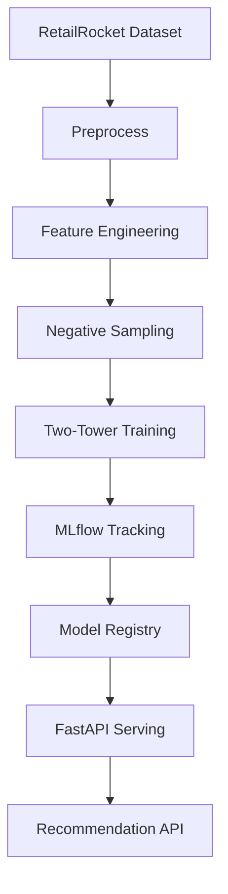
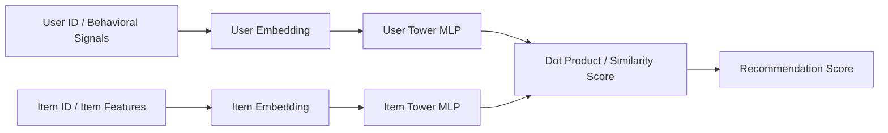

# TwinRank AI

**Deep Learning Recommendation Engine**

[](https://pytorch.org/)
[](https://fastapi.tiangolo.com/)
[](https://mlflow.org/)
[](https://dvc.org/)
[](https://docs.astral.sh/ruff/)
[](https://docs.pytest.org/)

> **Learning Intent. Ranking Experiences.**
>
> Every interaction tells a story. TwinRank AI learns it.
>
> ## 📊 Impact at a Glance

| Metric | Value | Context |
|---|---|---|
| **Architecture** | **Two-Tower Neural Network** | Shared embedding space for users and items |
| **Ranking metrics** | **Recall@K, NDCG@K, MAP@K, MRR@K** | Ranking-oriented evaluation (not classification accuracy) |
| **Signal type** | **Implicit behavioral** | Clicks, views, cart events, purchases — no explicit ratings |
| **ML stack** | **PyTorch + MLflow + DVC** | Reproducible pipelines, experiment tracking, versioning |
| **Serving** | **FastAPI REST API** | `uvicorn reco.serving.api:app` |
| **Pipeline** | **`dvc repro`** | Full reproducible pipeline in one command |
| **Negative sampling** | **✅ Implemented** | In-batch + hard negatives for better representation learning |

> **Why Two-Tower?** Popularity-based recommenders push the same items to everyone. Two-Tower learns *user intent* from behavioral patterns, mapping users and items into a shared semantic space — enabling personalization at scale without explicit ratings.

---


TwinRank AI is a production-oriented recommendation engine for e-commerce. It learns user intent from implicit signals such as clicks, views, cart events, and purchases, then maps users and items into a shared embedding space with a Two-Tower model.

The project combines Deep Learning, Machine Learning Engineering, and MLOps in a reproducible pipeline for experimentation and deployment. Instead of relying only on popularity or static rules, it learns behavioral patterns with traceability, versioning, and operational rigor.

## Quick Links

- [Architecture](docs/architecture.md)
- [Model Card](docs/model_card.md)
- [Dataset](#dataset)
- [Setup Local](#setup-local)
- [Metrics](#metrics)

---

## Product Vision

Imagine a store with millions of products. A few views, a cart addition, a removal, and a later return can already reveal intent. TwinRank AI turns those signals into structured representations that support personalized recommendations at scale.

More than a model, TwinRank AI is a compact recommendation platform blueprint: clean code, reproducible pipelines, experiment tracking, and lifecycle management close to what production ML systems require.

---

## Why TwinRank AI

- Learns from behavioral signals instead of depending only on popularity.
- Uses neural embeddings for personalized ranking.
- Supports scalable retrieval and ranking workflows through shared latent space.
- Organizes data, experiments, and model lifecycle with reproducibility in mind.
- Aligns software engineering and MLOps practices with recommendation development.

---

## Core Architecture

TwinRank AI is centered on a Two-Tower recommendation architecture. One tower learns a representation of the user from interaction history and contextual behavioral features, while the other learns a representation of the item from product identity and optional metadata. Recommendation relevance is computed from the similarity between those two embeddings, often using a dot product or related scoring function.

This design is widely used for large-scale recommendation because it separates user and item encoding, making retrieval efficient and enabling representation learning in a shared vector space.

## Dataset

The project is based on the RetailRocket E-commerce Dataset, with focus on the main interaction sources:

- `events.csv`
- `item_properties.csv`
- `category_tree.csv`

Suggested download:

```bash
kaggle datasets download -d retailrocket/ecommerce-dataset -p data/raw --unzip
```



### Model View



---

## Repository Structure

```text
TwinRank-AI/
├── src/
│   └── reco/
│       ├── data/
│       ├── models/
│       ├── pipelines/
│       ├── serving/
│       ├── training/
│       └── utils/
├── tests/
├── scripts/
├── configs/
├── data/
├── models/
├── docs/
├── dvc.yaml
├── pyproject.toml
├── docker-compose.yml
└── Dockerfile
```

The repository is organized to separate concerns across data processing, feature generation, model training, evaluation, serving, and infrastructure. This layout supports clean code practices, testability, and a reproducible workflow from raw events to deployed recommendation endpoints.

---

## Expected Pipeline

TwinRank AI is designed as a reproducible ML pipeline with explicit data and experiment lineage:

1. Preprocess raw interaction logs and build user-item events.
2. Engineer features and create indexed representations for users and items.
3. Generate training pairs with negative sampling.
4. Train the Two-Tower neural model in PyTorch.
5. Evaluate ranking quality using recommendation metrics.
6. Track runs, metrics, and artifacts in MLflow.
7. Register the best model version and promote it through lifecycle stages.
8. Serve recommendations through an API layer.

This workflow mirrors the staged pipelines used in practical ML systems, where reproducibility, observability, and controlled promotion matter as much as offline metrics.

---

## Technology Stack

| Layer | Tools |
|--------|-------|
| Deep Learning | PyTorch |
| Baselines / Preprocessing | Scikit-Learn |
| API | FastAPI |
| Experiment Tracking | MLflow |
| Data and Pipeline Versioning | DVC |
| Containerization | Docker, Docker Compose |
| Dependency Management | Poetry |
| Quality | Pytest, Ruff, pre-commit |
| CI/CD | GitHub Actions |

These technologies reflect a modern MLOps-oriented stack for recommendation workflows, especially when model experimentation, reproducibility, and deployment-readiness are first-class concerns.

## Setup Local

```bash
make install
make validate
make lint
make test
make mlflow-ui
```

Run the API locally:

```bash
python -m uvicorn reco.serving.api:app --reload
```

Run the full pipeline:

```bash
dvc repro
```

---

## Metrics

TwinRank AI evaluates recommendation quality with ranking-oriented metrics instead of relying only on classification-style accuracy. For recommendation systems, metrics such as Recall@K, MAP@K, MRR@K, and NDCG@K provide a more meaningful view of whether the model surfaces relevant items in useful positions.

| Model | Recall@10 | MAP@10 | MRR@10 | NDCG@10 |
|--------|-----------|--------|--------|---------|
| Popularity Baseline | TBD | TBD | TBD | TBD |
| Matrix Factorization / Baseline | TBD | TBD | TBD | TBD |
| Two-Tower Neural Model | TBD | TBD | TBD | TBD |

The final values should be filled from tracked runs in MLflow.

### Current Status

- Core documentation and architecture are in place.
- Preprocessing, feature engineering, training, evaluation, and serving scaffolds are implemented.
- The remaining work is production deployment, CI hardening, and retrieval/cache improvements.

---

## Engineering Principles

TwinRank AI is intentionally built as an engineering-first ML project. The implementation aims to follow modular design, descriptive naming, type hints, environment externalization, and testable boundaries across data, model, and API layers. Those choices are essential for turning a model into a maintainable system rather than a one-off experiment.

Design patterns such as Factory and Strategy are suitable for the project because they help standardize model creation, preprocessing choices, and experiment flows without coupling the codebase to a single implementation path. This is especially useful when comparing baselines against a neural recommender under a shared pipeline.

---

## Mission

Democratize modern recommendation systems through a reproducible, scalable, and Deep Learning-oriented architecture that transforms behavioral data into high-quality personalized experiences.

## Vision

Become a strong open reference for recommendation system engineering, showing how Deep Learning, MLOps, and software engineering practices can converge in systems close to those used by large-scale e-commerce platforms.

## Values

- Data-driven intelligence
- Production-grade engineering
- Reproducibility
- Continuous learning
- Transparency and traceability
- Scalability
- Clean, collaborative code

---

## Manifesto

Each click represents an intention. Each abandoned cart tells part of a story. Each purchase confirms a need. In digital commerce, users rarely state explicitly what they want; they reveal it through behavior.

TwinRank AI was created to interpret those hidden signals and continuously learn how to connect people to the most relevant products. More than a recommendation algorithm, it represents the intersection of Deep Learning, software engineering, and MLOps to build intelligent, scalable, and reproducible systems.

Because recommending products is not only about predicting the next click. It is about understanding the intention behind every interaction.

---

## Documentation

- [Architecture](docs/architecture.md) — system design, components, pipeline, and serving architecture.
- [Model Card](docs/model_card.md) — model scope, training context, metrics, limitations, risks, and deployment notes.

---

## Roadmap

- [x] Product positioning and repository narrative
- [x] README redesign with visual project framing
- [x] Architecture and Model Card documentation
- [x] Data preprocessing pipeline
- [x] Feature engineering for RetailRocket interactions
- [x] Negative sampling strategy
- [x] Popularity baseline
- [x] Matrix factorization / classic baseline
- [x] Two-Tower neural recommender
- [x] MLflow experiment tracking
- [x] DVC reproducible pipeline
- [x] Docker multi-stage environment
- [x] Model Registry promotion flow
- [x] FastAPI recommendation service
- [ ] Production deployment
- [ ] GitHub Actions CI
- [ ] FAISS retrieval layer
- [ ] Redis recommendation cache
- [ ] Streamlit dashboard

---

## Project Status

TwinRank AI is currently evolving from a strong portfolio-grade architecture and documentation layer into a fully reproducible recommendation engineering system with DVC, Docker, MLflow Registry, and production-oriented training and serving workflows. The current focus is to close the gap between presentation quality and true operational readiness.
# TwinRankAI
