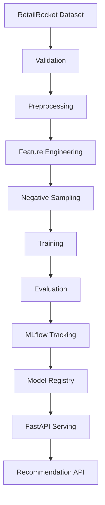

# Arquitetura TwinRank AI

Este documento resume a arquitetura de alto nível do projeto e serve como base
para a apresentação do repositório e para a Model Card.

## Visão geral

TwinRank AI foi desenhado como um sistema de recomendação industrial para
e-commerce, com pipeline reprodutível, comparação com baselines e uma camada de
serving preparada para evoluir para produção.

## Componentes principais

### Data layer

- Validação de schema e consistência.
- Mapeamento de eventos implícitos para relevância ponderada.
- Organização do conjunto bruto, intermediário e processado.

### Model layer

- Popularity Recommender como baseline mínimo.
- Matrix Factorization como baseline clássico.
- Two-Tower neural recommender como modelo principal.

### Training layer

- Treino com PyTorch.
- Negative sampling para feedback implícito.
- Early stopping para reduzir overfitting e custo de treino.
- Avaliação em métricas de ranking top-K.

### Serving layer

- API FastAPI para exposição de recomendações.
- Separação clara entre treino, avaliação e inferência.

## Padrões de projeto usados

- **Factory**: seleção do modelo em tempo de execução.
- **Strategy**: troca do pré-processamento sem acoplar o pipeline.
- **Settings centralizadas**: configuração via Pydantic Settings.

## Evolução planejada

## Observação

Este documento descreve a narrativa arquitetural desejada para o projeto. As
próximas entregas devem fechar a camada de MLOps com DVC, Docker e promoção de
modelo no MLflow Registry.