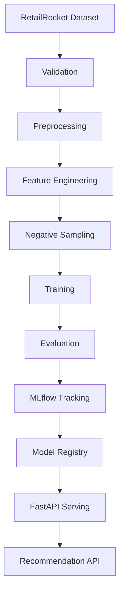
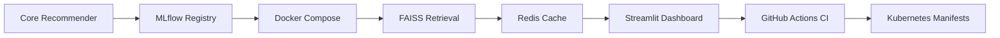

# Arquitetura TwinRank AI

Este documento resume a arquitetura de alto nível do projeto e serve como base
para a apresentação do repositório e para a Model Card.

## Visão geral

TwinRank AI foi desenhado como um sistema de recomendação industrial para
e-commerce, com pipeline reprodutível, comparação com baselines e uma camada de
serving preparada para evoluir para produção.

```mermaid
flowchart TD
    A[RetailRocket Dataset] --> B[Validation]
    B --> C[Preprocessing]
    C --> D[Feature Engineering]
    D --> E[Negative Sampling]
    E --> F[Training]
    F --> G[Evaluation]
    G --> H[MLflow Tracking]
    H --> I[Model Registry]
    I --> J[FastAPI Serving]
    J --> K[Recommendation API]
```

## Componentes principais

### Data layer

- Validação de schema e consistência.
- Mapeamento de eventos implícitos para relevância ponderada.
- Organização do conjunto bruto, intermediário e processado.

### Model layer

- Popularity Recommender como baseline mínimo.
- Matrix Factorization como baseline clássico.
- Two-Tower neural recommender como modelo principal.

### Training layer

- Treino com PyTorch.
- Negative sampling para feedback implícito.
- Early stopping para reduzir overfitting e custo de treino.
- Avaliação em métricas de ranking top-K.

### Serving layer

- API FastAPI para exposição de recomendações.
- Separação clara entre treino, avaliação e inferência.
- Índice FAISS para recuperação por similaridade, em vez de varredura do
  catálogo a cada requisição.
- Cache-aside em Redis, com degradação silenciosa quando o Redis está fora.
- Fallback de popularidade para visitantes ausentes do índice de treino.

### Infra layer

- Dockerfile multi-stage, com o wheel de CPU do PyTorch.
- `docker-compose.yml` para o ambiente local completo.
- Manifests Kubernetes em `k8s/`, com HPA por CPU, validados em cluster kind.

## Padrões de projeto usados

- **Factory**: seleção do modelo em tempo de execução.
- **Strategy**: troca do pré-processamento sem acoplar o pipeline.
- **Settings centralizadas**: configuração via Pydantic Settings.

## Camadas já entregues

```mermaid
flowchart LR
    A[Core Recommender] --> B[MLflow Registry]
    B --> C[Docker Compose]
    C --> D[FAISS Retrieval]
    D --> E[Redis Cache]
    E --> F[Streamlit Dashboard]
    F --> G[GitHub Actions CI]
    G --> H[Kubernetes Manifests]
```

## Observação

A camada de MLOps está fechada: dados versionados com DVC, pipeline de quatro
stages, imagem Docker multi-stage e modelo promovido a Production no MLflow
Registry. O que falta para produção de verdade é publicar a API em URL pública
e substituir o `POST /train` por uma fila de jobs dedicada.
